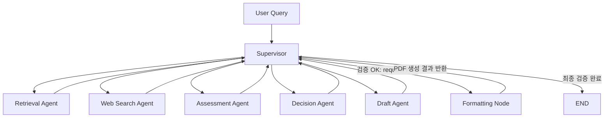
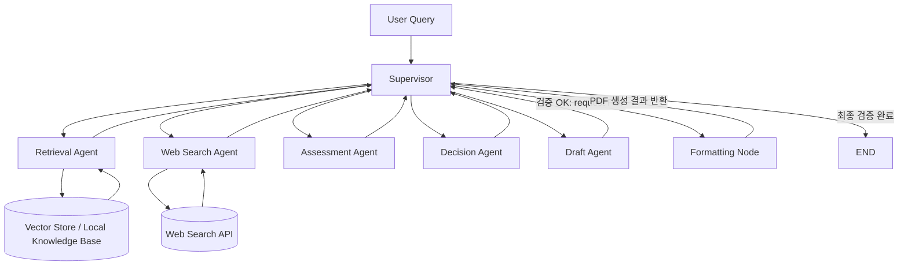

# AI Mini - Tech Strategy Decision Workflow

## Abstract

HBM4, PIM, CXL 기술에 대해 경쟁사 공개 근거를 수집하고, TRL 기반 기술 성숙도와 Threat 수준을 평가해 SK hynix의 R&D 우선순위를 제안하는 LangGraph 기반 기술 전략 분석 workflow입니다.

## Overview

- Objective : 기술 경쟁 구도와 공개 근거를 바탕으로 SK hynix의 R&D 추진 타당성과 우선순위를 판단한다.
- Method : `Supervisor` 중심 LangGraph workflow, hybrid retrieval, bias-aware web search, evidence-based assessment, staged report drafting.
- Tools : LangGraph, LangChain, OpenAI API, Tavily, Sentence Transformers, ReportLab, PyPDF

## Features

| Feature | Description |
|---|---|
| Local Retrieval | PDF / TXT / Markdown 자료를 기반으로 기본 지식과 기술 배경을 검색한다. |
| Web Search | 최신 뉴스, 공식 발표, 반증 자료를 함께 수집하고 출처 신뢰도와 최신성을 점수화한다. |
| Evidence Synthesis | 직접 근거와 특허, 채용, 투자, 생태계 활동 같은 간접 지표를 구분해 정리한다. |
| Competitor Scope | 기준 기업 `SK hynix`와 비교 대상 경쟁사를 상태상에서 분리해 self-row가 Decision 평균에 섞이지 않도록 처리한다. |
| TRL Assessment | TRL 1~9 기준으로 기술 성숙도를 평가하고, TRL 4~6은 공개 정보 기반 추정 한계를 명시한다. |
| Threat Assessment | 기술 성숙도, 시장 영향력, 경쟁 강도를 반영해 High / Medium / Low 위협 수준을 산정한다. |
| Decision | Go / Hold / Monitor 권고와 High / Medium / Low 우선순위를 생성한다. |
| Query Rewrite | 실패 원인에 따라 기술 세부 키워드, 최신성 키워드, 출처 다양성 키워드를 보강해 재검색한다. |
| Bias Control | positive query와 counter-evidence query를 함께 생성하고 source diversity, bias risk score를 검증한다. |
| Draft Control | Draft가 직접 종료하지 않고 Supervisor 검증을 거치며, 나열형 초안은 분석형 fallback 초안으로 대체한다. |
| Formatting | Markdown을 PDF로 변환하고 텍스트 추출 기반으로 섹션 순서와 내용 손실 여부를 검증한다. |
| Runtime Safety | Custom exception, retry, timeout, logging으로 외부 API 오류와 장시간 실행을 제어한다. |

## Tech Stack

| Category | Details |
|---|---|
| Framework | LangGraph, LangChain, Python |
| LLM | `gpt-4.1-mini`, `gpt-4.1` via OpenAI API |
| Retrieval | FAISS Vector Store + Dense-first Hybrid Retrieval with lexical fallback, Hit Rate@K, MRR |
| Embedding | `intfloat/multilingual-e5-large` |
| Search | Tavily |
| Output | Markdown, PDF (`reportlab` renderer) |

## Retrieval Evaluation

Current measured metrics (`data/eval/retrieval_eval.sample.json`, sample set size = 12):

| Metric | Score |
|--------|------:|
| Hit Rate@1 | `0.3333` |
| Hit Rate@3 | `0.6667` |
| Hit Rate@5 | `0.8333` |
| MRR | `0.5417` |

Interpretation note:

- `Hit Rate@K`와 `MRR`은 문서 제목 매칭이 아니라 본문 근거 문자열과 기대 PDF source를 함께 만족하는지 확인한다.
- 진단 결과, 기대 PDF source 기준으로는 `Hit Rate@1=0.8333`, `Hit Rate@3=1.00`, `MRR=0.9167`이며, 낮아지는 부분은 주로 정확한 근거 chunk의 순위 문제다.
- stale vector store 영향을 피하기 위해 기본 평가에서는 cached FAISS vector store를 사용하지 않는다.
- 따라서 이 수치는 최종 선정한 hybrid dense/lexical retrieval이 엄격한 본문 근거 평가셋에서 정답 chunk를 얼마나 잘 찾는지 보여준다.

## Agents

- Supervisor: 단계 검증, 재시도 제어, 종료 판단
- Retrieval Agent: 로컬 문서 기반 기본 지식 검색
- Web Search Agent: 최신 정보와 반증 정보 확보
- Assessment Agent: evidence synthesis + TRL + threat
- Decision Agent: Go / Hold / Monitor 및 Priority 결정
- Draft Agent: 보고서 초안 생성
- Formatting Node: Markdown -> PDF 변환

## Architecture

Pattern:

- `Supervisor`

Reason:

- 각 단계가 이전 단계 품질에 강하게 의존한다.
- Draft 조기 종료를 막아야 한다.
- PDF 생성 성공 여부를 Supervisor가 최종 확인해야 한다.

### Workflow Orchestration



### Component View

메인 workflow 다이어그램은 제어 구조를 보여주기 위한 것이므로, Vector Store는 Supervisor 흐름 안에 직접 넣지 않고 Retrieval Agent의 하위 컴포넌트로 분리해 표현한다.



## Failure Handling

이 프로젝트는 각 Agent가 실패했을 때 직접 종료하지 않고, 실패 원인과 품질 검증 결과를 상태에 기록한 뒤 Supervisor가 재실행 또는 이전 단계 회귀를 결정한다.

| Stage | Failure trigger | Stored signal | Supervisor action |
|---|---|---|---|
| Query interpretation | Planner LLM parsing 실패 | fallback query interpretation 사용 | 규칙 기반 기술/경쟁사 추출과 query plan으로 계속 진행 |
| Retrieval Agent | 후보 문서 없음, 점수 부족, 기술/경쟁사 키워드 불일치, 관련 문서 수 부족 | `retrieval.is_success=False`, `failure_reason`, `attempt`, `query_rewrite_history` | 실패 원인별 query rewrite 후 Retrieval 재실행 |
| Web Search Agent | 최신성 부족, 출처 다양성 부족, 반증 근거 부재, 출처 신뢰도 부족, 편향 위험 과다, 경쟁사 커버리지 불균형, API 오류 | `web_search.is_success=False`, `failure_reason`, `attempt`, `query_rewrite_history` | balanced positive/counter query를 다시 구성해 Web Search 재실행 |
| Information sufficiency gate | Retrieval/Web Search 각각은 끝났지만 전체 정보 품질 기준 미달 | `control.is_information_sufficient=False`, `coverage_status` | 부족 원인에 따라 Retrieval 또는 Web Search로 회귀 |
| Assessment Agent | pair 누락, evidence 부족, TRL rationale 부재, TRL 4~6 uncertainty 부재, threat rationale 부재, 직접 근거 부족 상태에서 과도한 TRL 부여 | `assessment.is_complete=False`, `failure_reason` | 원인에 따라 Retrieval, Web Search, Assessment 중 적절한 단계로 회귀 |
| Decision Agent | recommendation 누락, 형식 오류, rationale 부족, 근거 연결 부족, action 부재 | `decision.is_valid=False`, `failure_reason` | 형식 문제면 Decision 재실행, 근거 부족이면 Assessment로 회귀 |
| Draft Agent | 필수 목차 누락, Decision 반영 부족, evidence linkage 부족, TRL 4~6 한계 문구 누락, list-heavy 초안 | `draft.is_valid=False`, `failure_reason`, `needs_revision=True` | Draft 재생성, 필요 시 분석형 fallback draft로 대체 |
| Formatting Node | PDF 생성 실패, 섹션 순서 손상, 내용 손실 추정 | `output.is_pdf_generated=False`, `format_error` | Formatting 재시도, 반복 실패 시 종료 |

### Retry policy

- 각 단계는 `attempt` 또는 `retry_count`를 통해 재시도 횟수를 누적한다.
- Supervisor는 실패 원인에 따라 동일 단계 재실행 또는 이전 단계 회귀를 선택한다.
- `max_iteration`을 초과하면 `status=failed`, `next_step=END`로 종료한다.
- 즉, 이 workflow는 선형 파이프라인이 아니라 “검증 -> 실패 원인 진단 -> 적절한 단계 재호출” 구조로 동작한다.

## Runtime Safety

- Exception handling:
  - `except Exception`으로 모든 오류를 뭉뚱그리지 않고, 외부 서비스 오류 / timeout / 포맷팅 오류 / 문서 로드 오류를 분리한다.
- Retry:
  - OpenAI, Tavily 같은 외부 호출은 retryable 오류에 한해서 exponential backoff를 적용한다.
- Timeout:
  - OpenAI 호출 timeout과 Tavily 검색 timeout, workflow 전체 timeout을 분리해 설정한다.
- Logging:
  - `tech_strategy.*` 네임스페이스 로거로 supervisor 라우팅, node 시작/종료, retry 이유, fallback 발생 원인을 남긴다.

## Report Structure

- SUMMARY
- 1. 분석 배경
- 2. 분석 대상 기술 현황
- 3. 경쟁사 동향 분석
- 4. 전략적 시사점
- REFERENCE

The report must explicitly state that TRL 4~6 is an estimate based on public information and indirect indicators.

## Directory Structure

```text
mini_project/
├── data/                  # PDF 문서와 Retrieval 평가 데이터
│   ├── eval/              # Hit Rate@K, MRR 평가용 샘플
│   └── knowledge_base/    # HBM, PIM, CXL 기반 자료
├── output/                # PDF / Markdown 결과와 FAISS vector store 저장
├── tech_strategy/         # Agent, State, Workflow 구현 패키지
│   ├── config.py          # 환경 변수와 실행 설정
│   ├── design_artifact.py # 설계 산출물 생성 스크립트
│   ├── formatting.py      # Markdown -> PDF 변환
│   ├── main.py            # workflow 실행 스크립트
│   ├── models.py          # 평가 결과 데이터 모델
│   ├── retrieval_eval.py  # Retrieval 평가 스크립트
│   ├── state.py           # LangGraph State 정의
│   ├── state_contracts.py # Node별 State 입출력 계약
│   ├── workflow.py        # LangGraph node와 edge 정의
│   └── services/          # 외부 서비스 연동
├── pyproject.toml         # Python 프로젝트 설정
└── README.md              # 프로젝트 설명 문서
```

## Generated Artifacts

- [Design Document PDF](data/DesignDocument.pdf)
- [Final report PDF](output/ai-mini_output_3반_배석현+박나연_project.pdf)
- [Final report Markdown](output/ai-mini_output_3반_배석현+박나연_project.md)

## Contributors

배석현: Design and Implementation of Draft Node, Formatting Node, Assessment Node, and Decision Node

박나연: Design of Retrieval Node, Query/Input Node, and Web Search Node, along with research and selection of RAG-related papers
