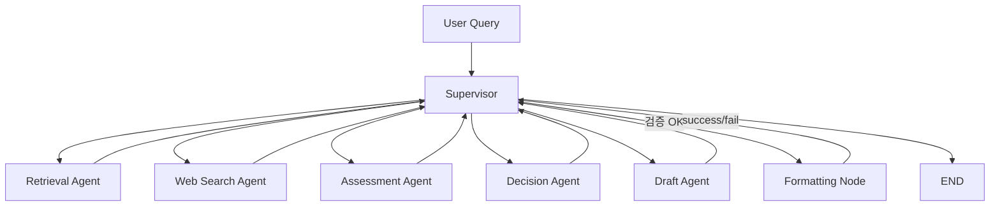

# AI Mini - Tech Strategy Decision Workflow

Semiconductor technology strategy workflow that analyzes HBM4, PIM, and CXL from competitor evidence, estimates TRL and threat, and generates a PDF report for R&D prioritization.

## Overview

- Objective : 기술 경쟁 구도와 공개 근거를 바탕으로 SK hynix의 R&D 추진 타당성과 우선순위를 판단한다.
- Method : `Supervisor` 중심 LangGraph workflow, hybrid retrieval, bias-aware web search, evidence-based assessment, staged report drafting.
- Tools : LangGraph, LangChain, OpenAI API, Tavily, Sentence Transformers, Matplotlib, PyPDF

## Features

- PDF / TXT / Markdown 자료 기반 기본 지식 검색
- 최신 뉴스 / 발표 / 반증 자료를 포함하는 Web Search
- 최근 1~2년 자료 우선, 최소 2개 이상 출처, 출처 신뢰도 점수를 반영하는 Web Search
- 직접 근거와 간접 지표를 구분하는 Evidence Synthesis
- TRL(1~9) 기반 기술 성숙도 평가
- Threat(High / Medium / Low) 기반 경쟁 위협 평가
- Go / Hold / Monitor + Priority(High / Medium / Low) 의사결정
- Draft -> Supervisor 검증 -> Formatting Node 순서를 지키는 보고서 생성
- 재검색은 동일 query 반복이 아니라, 실패 원인에 따라 query를 재구성하여 수행
- Retrieval / Web Search Agent는 내부에서 실패 원인을 진단하고 query를 재작성
- 확증 편향 방지 전략 :
  - positive query와 counter-evidence query를 함께 생성
  - source diversity와 bias risk score를 함께 측정
  - official / standards / academic / reputable media / general web 기준으로 출처 신뢰도를 점수화
  - 반증 자료가 없으면 Web Search Agent가 counter query를 확장하고 Supervisor가 재실행을 승인
  - 편향 완화를 위해 반증 query를 별도로 확장
- Query rewrite 전략 :
  - 관련성 부족 시 기술 세부 키워드와 문서 유형 키워드를 추가
  - 최신성 부족 시 최근 연도 / 발표 / 보도자료 키워드를 강화
  - 출처 다양성 부족 시 공식 발표 / 뉴스 / 학회 발표 쿼리를 분리
- TRL 4~6 추정 한계 명시 :
  - 보고서에 공개 정보 기반 추정임을 명시
  - TRL 4 이상은 내부 문서, 통합 검증 기록, 공정/수율 데이터, 고객 샘플 검증 자료 없이는 정확 판정이 어렵다는 점을 보고서에 명시
  - 특허 / 학회 발표 / 채용 공고와 같은 간접 지표를 함께 근거로 사용
- Decision 제어 :
  - Assessment가 충분하지 않으면 Decision을 보류
  - Decision rationale이 TRL / Threat / Evidence / Competitor와 연결되지 않으면 Assessment로 재귀
  - Decision 형식 누락은 Decision 단계 재실행, 근거 부족은 Assessment 단계 재실행으로 분리
- Draft 제어 :
  - Draft는 초안 생성만 수행하고 직접 종료하지 않음
  - 필수 섹션, Decision 반영, 근거 연결, TRL 4~6 한계 문구를 Supervisor가 검증
  - 초안이 bullet 위주 나열형이면 분석형 fallback 초안으로 재생성
- Formatting 제어 :
  - Formatting Node는 PDF 생성만 수행
  - 생성 후 PDF 텍스트 추출 기반으로 섹션 순서와 내용 손실 여부를 검증
  - 검증 실패 시 Formatting 실패로 처리되어 Supervisor가 재시도 또는 오류 종료를 결정

## Tech Stack

| Category | Details |
|---|---|
| Framework | LangGraph, LangChain, Python |
| LLM | `gpt-4.1-mini`, `gpt-4.1` via OpenAI API |
| Retrieval | Hybrid Dense + Lexical |
| Embedding | `intfloat/multilingual-e5-large` |
| Search | Tavily |
| Output | Markdown, PDF |

## Retrieval Design

### Embedding Candidates

- `intfloat/multilingual-e5-large`
- `BAAI/bge-m3`
- `sentence-transformers/paraphrase-multilingual-mpnet-base-v2`

Selection criteria:

- 한국어/영어 혼합 기술 문서 처리 성능
- 기술명, 기업명, 표준명 exact term 보존력
- 긴 PDF chunk semantic 검색 성능
- CPU 환경 실행 가능성
- 오픈소스 사용 가능성

Final choice:

- `intfloat/multilingual-e5-large`

### Retrieval Technique Candidates

- Dense similarity
- BM25 / lexical retrieval
- Hybrid retrieval
- MMR
- MultiQuery
- Parent document retrieval

Selection criteria:

- Hit Rate@K
- MRR
- 기술 키워드 exact match 성능
- semantic relevance
- 중복 억제 성능
- 운영 복잡도

Final choice:

- Hybrid Dense + Lexical

### Retrieval Evaluation

Reference:

- [`10-Retriever-Evaluation.ipynb`](/Users/hyun/workspace/ai_mini/langchain-v1/14-Retriever/10-Retriever-Evaluation.ipynb)

Evaluation script in this project:

```bash
/Users/hyun/workspace/ai_mini/langgraph-v1/.venv/bin/python -m tech_strategy.retrieval_eval
```

Current README metrics status:

- Hit Rate@K : pending domain corpus + labeled eval set
- MRR : pending domain corpus + labeled eval set

When the corpus is finalized, update this section with the measured values from `tech_strategy.retrieval_eval`.

## Agents

- Supervisor: 단계 검증, 재시도 제어, 종료 판단
- Retrieval Agent: 로컬 문서 기반 기본 지식 검색
- Web Search Agent: 최신 정보와 반증 정보 확보
- Assessment Agent: evidence synthesis + TRL + threat
- Decision Agent: Go / Hold / Monitor 및 Priority 결정
- Draft Agent: 보고서 초안 생성
- Formatting Node: Markdown -> PDF 변환

## Architecture

Pattern:

- `Supervisor`

Reason:

- 각 단계가 이전 단계 품질에 강하게 의존한다.
- Draft 조기 종료를 막아야 한다.
- PDF 생성 성공 여부를 Supervisor가 최종 확인해야 한다.



## Report Structure

- SUMMARY
- 1. 분석 배경
- 2. 분석 대상 기술 현황
- 3. 경쟁사 동향 분석
- 4. 전략적 시사점
- REFERENCE

The report must explicitly state that TRL 4~6 is an estimate based on public information and indirect indicators.

## Directory Structure

```text
mini_project/
├── data/
│   ├── eval/
│   └── knowledge_base/
├── output/
├── tech_strategy/
│   ├── config.py
│   ├── design_artifact.py
│   ├── formatting.py
│   ├── main.py
│   ├── models.py
│   ├── retrieval_eval.py
│   ├── state.py
│   └── workflow.py
├── pyproject.toml
└── README.md
```

## Run

Copy `.env.example` to `.env` and fill in `OPENAI_API_KEY`, `TAVILY_API_KEY`, and optionally `LANGSMITH_API_KEY`.
For Tavily credit control during testing, keep `TS_TAVILY_MAX_RESULTS=3`, `TS_MAX_WEB_QUERIES=6`, and `TS_MAX_ITERATION=3`.

Generate the design artifact:

```bash
/Users/hyun/workspace/ai_mini/langgraph-v1/.venv/bin/python -m tech_strategy.design_artifact \
  --team-label "3반_배석현+박나연"
```

Generate the report template artifact:

```bash
/Users/hyun/workspace/ai_mini/langgraph-v1/.venv/bin/python -m tech_strategy.report_template \
  --team-label "3반_배석현+박나연"
```

Run the workflow:

```bash
cd /Users/hyun/workspace/ai_mini/mini_project
/Users/hyun/workspace/ai_mini/langgraph-v1/.venv/bin/python -m tech_strategy.main \
  "HBM4, PIM, CXL 기준으로 Samsung, Micron 대비 SK hynix의 R&D 우선순위를 분석해줘" \
  --team-label "3반_배석현+박나연"
```

Expected output files:

- `output/ai-mini_design_3반_배석현+박나연.pdf`
- `output/ai-mini_output_3반_배석현+박나연.pdf`

## Contributors

- 배석현 : Prompt Engineering, Agent Design, Assessment / Decision Logic
- 박나연 : Retrieval / Evaluation, Documentation, Draft / PDF Formatting
