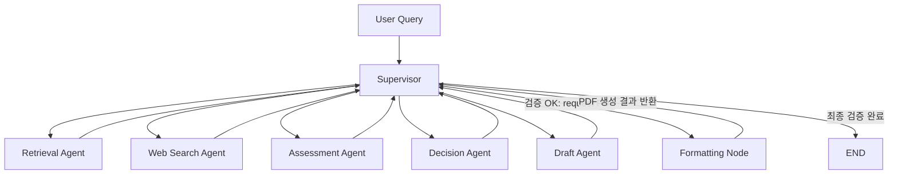
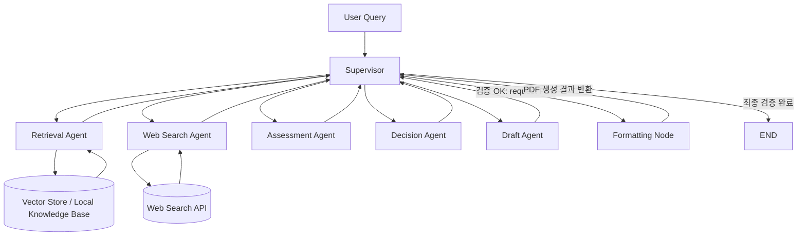

# AI Mini - Tech Strategy Decision Workflow

## Abstract

Semiconductor technology strategy workflow that analyzes HBM4, PIM, and CXL from competitor evidence, estimates TRL and threat, and generates a PDF report for R&D prioritization.

## Overview

- Objective : 기술 경쟁 구도와 공개 근거를 바탕으로 SK hynix의 R&D 추진 타당성과 우선순위를 판단한다.
- Method : `Supervisor` 중심 LangGraph workflow, hybrid retrieval, bias-aware web search, evidence-based assessment, staged report drafting.
- Tools : LangGraph, LangChain, OpenAI API, Tavily, Sentence Transformers, ReportLab, PyPDF

## Features

- PDF / TXT / Markdown 자료 기반 기본 지식 검색
- 최신 뉴스 / 발표 / 반증 자료를 포함하는 Web Search
- 최근 1~2년 자료 우선, 최소 2개 이상 출처, 출처 신뢰도 점수를 반영하는 Web Search
- 직접 근거와 간접 지표를 구분하는 Evidence Synthesis
- 기준 기업(`SK hynix`)과 비교 대상 경쟁사를 상태상에서 분리해 self-row가 Decision 평균에 섞이지 않도록 처리
- TRL(1~9) 기반 기술 성숙도 평가
- Threat(High / Medium / Low) 기반 경쟁 위협 평가
- Go / Hold / Monitor + Priority(High / Medium / Low) 의사결정
- Draft -> Supervisor 검증 -> Formatting Node 순서를 지키는 보고서 생성
- 재검색은 동일 query 반복이 아니라, 실패 원인에 따라 query를 재구성하여 수행
- Retrieval / Web Search Agent는 내부에서 실패 원인을 진단하고 query를 재작성
- 확증 편향 방지 전략 :
  - positive query와 counter-evidence query를 함께 생성
  - source diversity와 bias risk score를 함께 측정
  - official / standards / academic / reputable media / general web 기준으로 출처 신뢰도를 점수화
  - 반증 자료가 없으면 Web Search Agent가 counter query를 확장하고 Supervisor가 재실행을 승인
  - 편향 완화를 위해 반증 query를 별도로 확장
- Query rewrite 전략 :
  - 관련성 부족 시 기술 세부 키워드와 문서 유형 키워드를 추가
  - 최신성 부족 시 최근 연도 / 발표 / 보도자료 키워드를 강화
  - 출처 다양성 부족 시 공식 발표 / 뉴스 / 학회 발표 쿼리를 분리
- TRL 4~6 추정 한계 명시 :
  - 보고서에 공개 정보 기반 추정임을 명시
  - TRL 4 이상은 내부 문서, 통합 검증 기록, 공정/수율 데이터, 고객 샘플 검증 자료 없이는 정확 판정이 어렵다는 점을 보고서에 명시
  - 특허 / 학회 발표 / 채용 공고와 같은 간접 지표를 함께 근거로 사용
- Decision 제어 :
  - Assessment가 충분하지 않으면 Decision을 보류
  - Decision rationale이 TRL / Threat / Evidence / Competitor와 연결되지 않으면 Assessment로 재귀
  - Decision 형식 누락은 Decision 단계 재실행, 근거 부족은 Assessment 단계 재실행으로 분리
- Draft 제어 :
  - Draft는 초안 생성만 수행하고 직접 종료하지 않음
  - 필수 섹션, Decision 반영, 근거 연결, TRL 4~6 한계 문구를 Supervisor가 검증
  - 초안이 bullet 위주 나열형이면 분석형 fallback 초안으로 재생성
- Formatting 제어 :
  - Formatting Node는 PDF 생성만 수행
  - 생성 후 PDF 텍스트 추출 기반으로 섹션 순서와 내용 손실 여부를 검증
  - 검증 실패 시 Formatting 실패로 처리되어 Supervisor가 재시도 또는 오류 종료를 결정
- 운영 안정성 강화 :
  - `TechStrategyError` 계층의 custom exception으로 LLM / Web Search / Formatting / Timeout 오류를 구분
  - Tavily / OpenAI 호출은 exponential backoff retry 정책을 적용
  - 외부 API와 전체 workflow 실행에 timeout을 둬 무한 대기를 방지
  - 각 node 시작 / 종료 / 재시도 / fallback 이유를 `logging`으로 기록

## Tech Stack

| Category | Details |
|---|---|
| Framework | LangGraph, LangChain, Python |
| LLM | `gpt-4.1-mini`, `gpt-4.1` via OpenAI API |
| Retrieval | FAISS Vector Store + Dense-first Hybrid Retrieval with lexical fallback, Hit Rate@K, MRR |
| Embedding | `intfloat/multilingual-e5-large` |
| Search | Tavily |
| Output | Markdown, PDF (`reportlab` renderer) |

## Retrieval Design

### Embedding Candidates

- `intfloat/multilingual-e5-large`
- `BAAI/bge-m3`
- `sentence-transformers/paraphrase-multilingual-mpnet-base-v2`

Selection criteria:

- 한국어/영어 혼합 기술 문서 처리 성능
- 기술명, 기업명, 표준명 exact term 보존력
- 긴 PDF chunk semantic 검색 성능
- CPU 환경 실행 가능성
- 오픈소스 사용 가능성

Final choice:

- `intfloat/multilingual-e5-large`

### Retrieval Technique Candidates

- Dense similarity
- BM25 / lexical retrieval
- Hybrid retrieval
- MMR
- MultiQuery
- Parent document retrieval

Selection criteria:

- Hit Rate@K
- MRR
- 기술 키워드 exact match 성능
- semantic relevance
- 중복 억제 성능
- 운영 복잡도

Final choice:

- Hybrid Dense + Lexical
- Runtime note:
  - 기본 설정은 FAISS vector store를 `output/vector_store/`에 저장해 다음 실행부터 문서 임베딩을 재사용한다.
  - 빠른 로컬 테스트는 `TS_EMBEDDING_BACKEND=hashing`을 사용할 수 있고, 의미 기반 검색 품질을 우선하면 `auto` 또는 `huggingface`를 사용한다.
  - 임베딩 모델을 초기화할 수 없거나 로컬 캐시가 없으면 lexical fallback으로 동작한다.
  - 따라서 `relevance_score`는 실행 시점에 dense-first hybrid 점수일 수도 있고 lexical fallback 점수일 수도 있다.

### Retrieval Evaluation

Reference:

- [`10-Retriever-Evaluation.ipynb`](/Users/hyun/workspace/ai_mini/langchain-v1/14-Retriever/10-Retriever-Evaluation.ipynb)

Evaluation script in this project:

```bash
/Users/hyun/workspace/ai_mini/langgraph-v1/.venv/bin/python -m tech_strategy.retrieval_eval
```

Current measured metrics (`data/eval/retrieval_eval.sample.json`, sample set size = 4):

- Hit@1 : `1.00`
- Hit@3 : `1.00`
- Hit@5 : `1.00`
- MRR : `1.00`

Interpretation note:

- 위 수치는 현재 저장소에 포함된 소규모 샘플 평가셋 기준이다.
- 샘플 평가셋은 제목/핵심 키워드 매칭이 비교적 명확한 질의로 구성되어 있어 `Hit@1=1.00`, `MRR=1.00`이 나올 수 있다.
- 따라서 이 수치는 현재 구현이 샘플 셋에서는 정답 문서를 안정적으로 찾았다는 의미이며, 일반적인 도메인 검색 성능 전체를 대표한다고 보기는 어렵다.
- 실제 제출 시 corpus와 라벨셋이 확정되면 같은 스크립트로 재측정해 갱신할 수 있다.

## Agents

- Supervisor: 단계 검증, 재시도 제어, 종료 판단
- Retrieval Agent: 로컬 문서 기반 기본 지식 검색
- Web Search Agent: 최신 정보와 반증 정보 확보
- Assessment Agent: evidence synthesis + TRL + threat
- Decision Agent: Go / Hold / Monitor 및 Priority 결정
- Draft Agent: 보고서 초안 생성
- Formatting Node: Markdown -> PDF 변환

## Architecture

Pattern:

- `Supervisor`

Reason:

- 각 단계가 이전 단계 품질에 강하게 의존한다.
- Draft 조기 종료를 막아야 한다.
- PDF 생성 성공 여부를 Supervisor가 최종 확인해야 한다.

### Workflow Orchestration



### Component View

메인 workflow 다이어그램은 제어 구조를 보여주기 위한 것이므로, Vector Store는 Supervisor 흐름 안에 직접 넣지 않고 Retrieval Agent의 하위 컴포넌트로 분리해 표현한다.



## Failure Handling

이 프로젝트는 각 Agent가 실패했을 때 직접 종료하지 않고, 실패 원인과 품질 검증 결과를 상태에 기록한 뒤 Supervisor가 재실행 또는 이전 단계 회귀를 결정한다.

| Stage | Failure trigger | Stored signal | Supervisor action |
|---|---|---|---|
| Query interpretation | Planner LLM parsing 실패 | fallback query interpretation 사용 | 규칙 기반 기술/경쟁사 추출과 query plan으로 계속 진행 |
| Retrieval Agent | 후보 문서 없음, 점수 부족, 기술/경쟁사 키워드 불일치, 관련 문서 수 부족 | `retrieval.is_success=False`, `failure_reason`, `attempt`, `query_rewrite_history` | 실패 원인별 query rewrite 후 Retrieval 재실행 |
| Web Search Agent | 최신성 부족, 출처 다양성 부족, 반증 근거 부재, 출처 신뢰도 부족, 편향 위험 과다, 경쟁사 커버리지 불균형, API 오류 | `web_search.is_success=False`, `failure_reason`, `attempt`, `query_rewrite_history` | balanced positive/counter query를 다시 구성해 Web Search 재실행 |
| Information sufficiency gate | Retrieval/Web Search 각각은 끝났지만 전체 정보 품질 기준 미달 | `control.is_information_sufficient=False`, `coverage_status` | 부족 원인에 따라 Retrieval 또는 Web Search로 회귀 |
| Assessment Agent | pair 누락, evidence 부족, TRL rationale 부재, TRL 4~6 uncertainty 부재, threat rationale 부재, 직접 근거 부족 상태에서 과도한 TRL 부여 | `assessment.is_complete=False`, `failure_reason` | 원인에 따라 Retrieval, Web Search, Assessment 중 적절한 단계로 회귀 |
| Decision Agent | recommendation 누락, 형식 오류, rationale 부족, 근거 연결 부족, action 부재 | `decision.is_valid=False`, `failure_reason` | 형식 문제면 Decision 재실행, 근거 부족이면 Assessment로 회귀 |
| Draft Agent | 필수 목차 누락, Decision 반영 부족, evidence linkage 부족, TRL 4~6 한계 문구 누락, list-heavy 초안 | `draft.is_valid=False`, `failure_reason`, `needs_revision=True` | Draft 재생성, 필요 시 분석형 fallback draft로 대체 |
| Formatting Node | PDF 생성 실패, 섹션 순서 손상, 내용 손실 추정 | `output.is_pdf_generated=False`, `format_error` | Formatting 재시도, 반복 실패 시 종료 |

### Retry policy

- 각 단계는 `attempt` 또는 `retry_count`를 통해 재시도 횟수를 누적한다.
- Supervisor는 실패 원인에 따라 동일 단계 재실행 또는 이전 단계 회귀를 선택한다.
- `max_iteration`을 초과하면 `status=failed`, `next_step=END`로 종료한다.
- 즉, 이 workflow는 선형 파이프라인이 아니라 “검증 -> 실패 원인 진단 -> 적절한 단계 재호출” 구조로 동작한다.

## Runtime Safety

- Exception handling:
  - `except Exception`으로 모든 오류를 뭉뚱그리지 않고, 외부 서비스 오류 / timeout / 포맷팅 오류 / 문서 로드 오류를 분리한다.
- Retry:
  - OpenAI, Tavily 같은 외부 호출은 retryable 오류에 한해서 exponential backoff를 적용한다.
- Timeout:
  - OpenAI 호출 timeout과 Tavily 검색 timeout, workflow 전체 timeout을 분리해 설정한다.
- Logging:
  - `tech_strategy.*` 네임스페이스 로거로 supervisor 라우팅, node 시작/종료, retry 이유, fallback 발생 원인을 남긴다.

## Environment Configuration

Recommended `.env` strategy:

- Secret keys:
  - `OPENAI_API_KEY`, `TAVILY_API_KEY`, `LANGSMITH_API_KEY`만 실제 비밀값으로 관리한다.
- Runtime controls:
  - `TS_OPENAI_TIMEOUT_SECONDS`
  - `TS_EXTERNAL_API_TIMEOUT_SECONDS`
  - `TS_EXTERNAL_API_MAX_RETRIES`
  - `TS_RETRY_BACKOFF_BASE_SECONDS`
  - `TS_RETRY_BACKOFF_MAX_SECONDS`
  - `TS_WORKFLOW_TIMEOUT_SECONDS`
  - `TS_LOG_LEVEL`
- Retrieval / search quality:
  - `TS_ENABLE_DENSE_RETRIEVAL`
  - `TS_ENABLE_VECTOR_STORE`
  - `TS_RETRIEVAL_SCORE_THRESHOLD`
  - `TS_MIN_RETRIEVED_DOCS`
  - `TS_EMBEDDING_LOCAL_ONLY`
  - `TS_TAVILY_MAX_RESULTS`
  - `TS_MAX_WEB_QUERIES`
  - `TS_MIN_WEB_RESULTS`
  - `TS_MIN_SOURCE_DIVERSITY`
  - `TS_MIN_RECENT_RATIO`
  - `TS_MIN_SOURCE_RELIABILITY`
  - `TS_MAX_BIAS_RISK`

Recommended values:

- Local debug / Tavily credit 절약:
  - `TS_MAX_ITERATION=1`
  - `TS_TAVILY_MAX_RESULTS=1`
  - `TS_MAX_WEB_QUERIES=2`
  - `TS_MIN_WEB_RESULTS=1`
  - `TS_MIN_SOURCE_DIVERSITY=1`
  - `TS_MIN_RECENT_RATIO=0.0`
  - `TS_MIN_SOURCE_RELIABILITY=0.60`
  - `TS_MAX_BIAS_RISK=1.0`
  - `TS_RETRIEVAL_SCORE_THRESHOLD=0.45`
  - `TS_MIN_RETRIEVED_DOCS=2`
  - `TS_LOG_LEVEL=DEBUG`
- Final deliverable run:
  - `TS_MAX_ITERATION=5`
  - `TS_TAVILY_MAX_RESULTS=3`
  - `TS_TAVILY_SEARCH_DEPTH=basic`
  - `TS_MAX_WEB_QUERIES=4`
  - `TS_MIN_WEB_RESULTS=3`
  - `TS_MIN_SOURCE_DIVERSITY=2`
  - `TS_MIN_RECENT_RATIO=0.4~0.5`
  - `TS_MIN_SOURCE_RELIABILITY=0.65~0.7`
  - `TS_OPENAI_TIMEOUT_SECONDS=90`
  - `TS_EXTERNAL_API_TIMEOUT_SECONDS=25`
  - `TS_EXTERNAL_API_MAX_RETRIES=2`
  - `TS_WORKFLOW_TIMEOUT_SECONDS=900`

## Report Structure

- SUMMARY
- 1. 분석 배경
- 2. 분석 대상 기술 현황
- 3. 경쟁사 동향 분석
- 4. 전략적 시사점
- REFERENCE

The report must explicitly state that TRL 4~6 is an estimate based on public information and indirect indicators.

## Directory Structure

```text
mini_project/
├── data/                  # PDF 문서와 Retrieval 평가 데이터
│   ├── eval/              # Hit Rate@K, MRR 평가용 샘플
│   └── knowledge_base/    # HBM, PIM, CXL 기반 자료
├── output/                # PDF / Markdown 결과와 FAISS vector store 저장
├── tech_strategy/         # Agent, State, Workflow 구현 패키지
│   ├── config.py          # 환경 변수와 실행 설정
│   ├── design_artifact.py # 설계 산출물 생성 스크립트
│   ├── formatting.py      # Markdown -> PDF 변환
│   ├── main.py            # workflow 실행 스크립트
│   ├── models.py          # 평가 결과 데이터 모델
│   ├── retrieval_eval.py  # Retrieval 평가 스크립트
│   ├── state.py           # LangGraph State 정의
│   ├── state_contracts.py # Node별 State 입출력 계약
│   ├── workflow.py        # LangGraph node와 edge 정의
│   └── services/          # 외부 서비스 연동
├── pyproject.toml         # Python 프로젝트 설정
└── README.md              # 프로젝트 설명 문서
```

## Run

Copy `.env.example` to `.env` and fill in `OPENAI_API_KEY`, `TAVILY_API_KEY`, and optionally `LANGSMITH_API_KEY`.
For Tavily credit control during testing, keep `TS_TAVILY_MAX_RESULTS=1`, `TS_TAVILY_SEARCH_DEPTH=basic`, `TS_MAX_WEB_QUERIES=2`, `TS_MIN_WEB_RESULTS=1`, `TS_MIN_SOURCE_DIVERSITY=1`, and `TS_MAX_ITERATION=1`.
For final-quality runs, raise those values after checking the remaining Tavily credits.
Set `TS_LOG_LEVEL=DEBUG` while tuning retrieval/web search, then switch to `INFO` for final runs.

Generate the design artifact:

```bash
/Users/hyun/workspace/ai_mini/langgraph-v1/.venv/bin/python -m tech_strategy.design_artifact \
  --team-label "3반_배석현+박나연"
```

Generate the report template artifact:

```bash
/Users/hyun/workspace/ai_mini/langgraph-v1/.venv/bin/python -m tech_strategy.report_template \
  --team-label "3반_배석현+박나연"
```

Run the workflow:

```bash
cd /Users/hyun/workspace/ai_mini/mini_project
/Users/hyun/workspace/ai_mini/langgraph-v1/.venv/bin/python -m tech_strategy.main \
  "HBM4, PIM, CXL 기준으로 Samsung, Micron 대비 SK hynix의 R&D 우선순위를 분석해줘" \
  --team-label "3반_배석현+박나연"
```

Expected output files:

- `output/ai-mini_design_3반_배석현+박나연.pdf`
- `output/ai-mini_output_3반_배석현+박나연.pdf`

## Generated Artifacts

- [Final report PDF](output/ai-mini_output_3반_배석현+박나연.pdf)
- [Final report Markdown](output/ai-mini_output_3반_배석현+박나연.md)

## Contributors

배석현: Design and Implementation of Draft Node, Formatting Node, Assessment Node, and Decision Node

박나연: Design of Retrieval Node, Query/Input Node, and Web Search Node, along with research and selection of RAG-related papers
